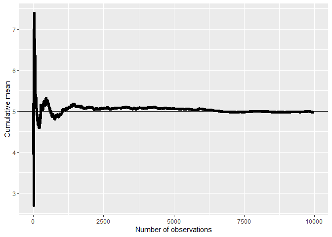
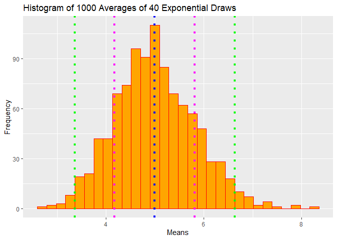

# Statistical Inference Course Project: Simulation and Inferential Data Analysis
## Author: Vin Lam

## Part 1: Simulation Exercise

## Overview:

In the first part of this exploration, we will examine the Law of Large Numbers and the Central Limit Theorem being put to work in simulating 1000 exponential distributions with 40 draws each and a lambda of 0.2. The goal is to show that these two important statistical properties allow us to yield very good approximations for the mean and standard deviation/variance of the true exponential distribution with lambda = 0.2. Not only very good approximations, but also that the distribution is close to normal. 

## Sample mean and theoretical mean

First let's calculate the theoretical mean of an exponential distribution with lambda = 0.2. This is a very simple calculation, because we know that the mean of an exponential distribution is 1/lambda (as well as the standard deviation), which turns out to be exactly 5. 

Now what about the sample mean? We will run 1000 simulations of exponentials with 40 draws and lambda = 0.2 and calculate the mean for every simulation. We will then take the average of all the means across every simulation to obtain our sample mean.


```r
mns = c() #initialize mns to an empty vector
for (i in 1:1000) # run 1000 simulations
  mns = c(mns, mean(rexp(40,0.2))) # store the means of every simulation into mns
mean(mns) # calculate the mean of mns, the sample mean
```

```
## [1] 4.965222
```

As it turns out, the sample mean is an extremely close approximation of the theoretical mean, 5. We can further show that with more draws upwards to infinity, the sample mean converges to the theoretical. 


```r
library(tidyverse)
n=10000 # set number of draws to n
means = cumsum(rexp(n,0.2))/(1:n) # create var means that calculates the mean after every draw
g <- ggplot(data.frame(x = 1:n, y = means), aes(x = x, y = y)) # plotting means, true mean at y=5
g <- g + geom_hline(yintercept = 5) + geom_line(size = 2) 
g <- g + labs(x = "Number of observations", y = "Cumulative mean")
g
```

<!-- -->

See how as the number of draws increases, the cumulative mean gets closer and closer to the true mean, 5. This is a clear demonstration of the LLN. 

## Sample variance and theoretical variance

We know that the theoretical standard deviation for the exponential distribution is also 1/lambda = 5. Thus, the variance is simply the square of the standard deviation, or 25. Let's plot the sample variance now using the var function. 


```r
variance = c() #initialize variance to empty vector
for(i in 1:1000) #do 1000 simulations
  variance = c(variance, var(rexp(40,0.2))) #store the variance of each simulation into the vector
hist(variance) #plot histogram of variance vector
```

<!-- -->

```r
mean(variance) #calculate the sample variance
```

```
## [1] 24.51862
```

As we expect, the sample variance is quite close to the theoretical variance, 25. 

## Can we show that the distribution is approximately normal?

At an initial glance, if we just plot a collection of random exponentials, we would of course see an exponential curve: a higher volume of low values and a lower volume of high values, forming a steep curve. Let's take a look right now. 


```r
hist(rexp(1000,0.2))
```

<!-- -->

Doesn't look very normal, right? Now what about a large collection of averages of 40 exponentials? Like before, we will run 1000 simulations of 40 draws from an exponential distribution, then take the average of each simulation and plot that.


```r
means = c()
for (i in 1:1000)
  means = c(means, mean(rexp(40,0.2)))
mu = mean(means)
s = sd(means)
lines = c(mu-2*s,mu-s,mu,mu+s,mu+2*s)
colors = c("green","magenta","blue","magenta","green")
g = ggplot(data.frame(means), aes(x = means))
g + geom_histogram(color = "red", fill = "orange") +
  geom_vline(xintercept = lines, linetype = "dotted", color = colors, size = 1.5) +
  xlab("Means") +
  ylab("Frequency") +
  ggtitle("Histogram of 1000 Averages of 40 Exponential Draws")
```

<!-- -->

This looks much more normal and approximately centered around the true mean of the distribution with vertical lines drawn at the mean (blue), 1 standard deviation from the mean (magenta), and 2 standard deviations from the mean (green). This is due to the Central Limit Theorem, which states that the distribution of averages of iid variables becomes that of a standard normal as the sample size increases. So, $\bar X_n$ is approximately $N(\mu, \sigma^2 / n)$ ;

Where $\mu$ $\approx$ 5 ; $\sigma^2$ $\approx$ 5, and n = 40 such that $\sigma$ $\approx$ 5/sqrt(40) $\approx$ 0.79.

## Part 2: Inferential Data Analysis

The second part of our exploration is to analyze the ToothGrowth dataset provided in the R datasets package. Let's load this dataset into R and take a look at what it contains. 


```r
library(datasets)
data("ToothGrowth")
TG = as_tibble(ToothGrowth)
str(TG)
```

```
## Classes 'tbl_df', 'tbl' and 'data.frame':	60 obs. of  3 variables:
##  $ len : num  4.2 11.5 7.3 5.8 6.4 10 11.2 11.2 5.2 7 ...
##  $ supp: Factor w/ 2 levels "OJ","VC": 2 2 2 2 2 2 2 2 2 2 ...
##  $ dose: num  0.5 0.5 0.5 0.5 0.5 0.5 0.5 0.5 0.5 0.5 ...
```

The ToothGrowth dataset contains 3 variables: len (numeric), supp (factor), and dose (numeric). Looking at the R documentation for this dataset tells us that it contains 60 observations for tooth length, supplement type, and vitamic C dosage in milligrams/day. The test subjects were 60 guinea pigs, with certain groups of guinea pigs receiving varying dosages of vitamin C (0.5,1,and 2 mg/day) and by one of two delivery methods: orange juice or ascorbic acid. The response variable here is tooth length, and it is dependent on the dosage levels of vitamic C given to the pig and the delivery method. Let's take a look at some of the summary statistics for this dataset, and whether or not there are any missing values.


```r
sum(is.na(TG))
```

```
## [1] 0
```

```r
summary(TG)
```

```
##       len        supp         dose      
##  Min.   : 4.20   OJ:30   Min.   :0.500  
##  1st Qu.:13.07   VC:30   1st Qu.:0.500  
##  Median :19.25           Median :1.000  
##  Mean   :18.81           Mean   :1.167  
##  3rd Qu.:25.27           3rd Qu.:2.000  
##  Max.   :33.90           Max.   :2.000
```

There are no missing values for any of the 60 observations, and it looks like the base R summary doesn't tell us any more than what we already know. Since we know that the two predictors, supp and dose, were varied in order to see their effect on tooth growth, we can try to capture their effects by grouping. First, let's only group by vitamin C dosage and compare the tooth growth with each of the 3 dosages. Next, we can group only by supplement, and compare tooth growth within the two supplements. 


```r
TG_Dose = TG %>% group_by(dose) %>% summarize(mlen = mean(len))
TG_Dose
```

```
## # A tibble: 3 x 2
##    dose  mlen
##   <dbl> <dbl>
## 1   0.5  10.6
## 2   1    19.7
## 3   2    26.1
```

```r
TG$dose = as.factor(TG$dose)
g = ggplot(TG, aes(x = dose, y = len, color = dose))
g + geom_boxplot(fill = "yellow") +
  xlab("Vitamin C Dosage") +
  ylab("Average Tooth Length") +
  ggtitle("Average Tooth Length by Vitamin C Dosage")
```

<!-- -->

What we find after grouping each observation together based on dosage is that there appears to be a clear positive relationship between guinea pig tooth length and vitamin C dosage. Since there are 3 groups, we can provide evidence for this relationship by constructing 95% confidence intervals for the difference in mean tooth length of each group and doing two-sample t tests. If the confidence intervals do not contain 0, then there is very strong evidence that the means between groups are not equal. Furthermore, the test statistic and p-value would also tell us that we would reject the null hypothesis  $\mu1$ = $\mu2$. This will be done by comparing the means of tooth length given doses 0.5 and 1, and then the means given doses 1 and 2.    

In the first test, our null hypothesis is that the mean(len|dose = 0.5) is equal to the mean(len|dose = 1). We begin by creating a subset of the ToothGrowth dataset which contains only observations where dosage = 0.5 or dosage = 1. Then, we perform a t.test using paired = FALSE. The reason for this is that there is no logic behind pairing pigs that received a 0.5mg dose of vitamin C with pigs that received a 1mg dose of vitamin C, since different pigs were used for each observation. It turns out the confidence interval remains unchanged whether var.equal is set to TRUE or FALSE, so we don't have to specify that parameter. We do a two-sided t test because if we reject, then by default we also reject the one-sided test.


```r
dose12 = subset(TG, dose == 0.5 | dose == 1)
t.test(len ~ dose, paired = FALSE, alternative = "two.sided", data = dose12)
```

```
## 
## 	Welch Two Sample t-test
## 
## data:  len by dose
## t = -6.4766, df = 37.986, p-value = 1.268e-07
## alternative hypothesis: true difference in means is not equal to 0
## 95 percent confidence interval:
##  -11.983781  -6.276219
## sample estimates:
## mean in group 0.5   mean in group 1 
##            10.605            19.735
```

The test statistic is -6.4766 and the p-value is extremely small, so we very clearly reject the null hypothesis that the difference in means is 0. Looking at the confidence interval, we can see the practical side of rejecting the null and observe that the difference between mean(len|dose = 1) and mean(len|dose = 0.5) is within that interval with 95% confidence. 

In the next test, our null hypothesis is that the mean(len|dose = 1) is equal to the mean(len|dose = 2). We follow exactly the same steps as before, except we subset out observations where dosage = 1 and dosage = 2. We perform the t test and examine the results.


```r
dose23 = subset(TG, dose == 1 | dose == 2)
t.test(len ~ dose, paired = FALSE, alternative = "two.sided", data = dose23)
```

```
## 
## 	Welch Two Sample t-test
## 
## data:  len by dose
## t = -4.9005, df = 37.101, p-value = 1.906e-05
## alternative hypothesis: true difference in means is not equal to 0
## 95 percent confidence interval:
##  -8.996481 -3.733519
## sample estimates:
## mean in group 1 mean in group 2 
##          19.735          26.100
```

Once again, we reject the null because our t-statistic is less than the alpha = 0.05 t quantile, and the p-value is less than 0.05. It also follows that we would reject for the null hypothesis mean(len|dose = 0.5) = mean(len}dose = 2) for obvious reasons. 

Now let's look at what happens to the mean tooth length when we group by supp. 


```r
TG_Supp = TG %>% group_by(supp) %>% summarize(mlen = mean(len))
TG_Supp
```

```
## # A tibble: 2 x 2
##   supp   mlen
##   <fct> <dbl>
## 1 OJ     20.7
## 2 VC     17.0
```

```r
g = ggplot(TG, aes(x = supp, y = len, color = supp))
g + geom_dotplot(binaxis = "y", stackdir = "center") +
  xlab("Supplement Type") +
  ylab("Average Tooth Length") +
  ggtitle("Average Tooth Length by Supplement")
```

<!-- -->

Looks like there is a slight difference in mean tooth length for pigs receiving orange juice versus ascorbic acid. Again, we define our null hypothesis to be mean(len|supp=OJ) = mean(len|supp=VC) and the alternative is that the difference is less than 0. Then we use t.test specifying supp as the explanatory variable of interest. Since there are only two levels in supp, we do not have to do any subsetting. 


```r
t.test(len ~ supp, paired = FALSE, alternative = "two.sided", data = TG)
```

```
## 
## 	Welch Two Sample t-test
## 
## data:  len by supp
## t = 1.9153, df = 55.309, p-value = 0.06063
## alternative hypothesis: true difference in means is not equal to 0
## 95 percent confidence interval:
##  -0.1710156  7.5710156
## sample estimates:
## mean in group OJ mean in group VC 
##         20.66333         16.96333
```

What we find is that with alpha = 0.05, we actually fail to reject the null hypothesis, because the p-value is > 0.05 and the confidence interval contains zero. However, note how close the p-value is to 0.05 and how the confidence interval barely contains zero. What might happen if we decide to do a one-sided test instead?


```r
t.test(len ~ supp, paired = FALSE, alternative = "greater", data = TG)
```

```
## 
## 	Welch Two Sample t-test
## 
## data:  len by supp
## t = 1.9153, df = 55.309, p-value = 0.03032
## alternative hypothesis: true difference in means is greater than 0
## 95 percent confidence interval:
##  0.4682687       Inf
## sample estimates:
## mean in group OJ mean in group VC 
##         20.66333         16.96333
```

Interestingly enough, now we do reject the null hypothesis, because the p-value is < 0.05 and the CI does not contain zero. Thus, we are in favor of the alternative that the difference in means is greater than zero. 

## Conclusions and Assumptions Needed

Based on the results of the t tests conducted, we conclude that greater dosages of vitamin C result in greater tooth lengths in guinea pigs. We also conclude that orange juice as a delivery method as opposed to ascorbic acid results in greater tooth lengths on average. For these conclusions to hold, we must assume that the data collected in this dataset were iid, and that the sample size is large enough that the t distribution becomes approximately standard normal.
